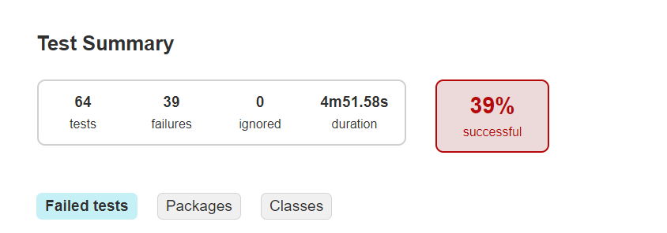

# Отчет о тестировании

В соответствии с планом тестирования было проведено 64 теста, из которых по 9 валидных тестов для форм покупки и покупки в кредит,

а также по 23 невалидных теста для данных форм. 39 тестов из 64 завершились ошибкой. Общий процент - успешности 39%.

На все ошибки заведено соответствующее issue.

## Перечень ошибок:

1. Для невалидного тестирования формы покупки (нумерация исходная для возможности сравнить с планом тестирования):

        3. Ввод в поле "Месяц" нулевого значения (00). Ожидание: ошибка "Неверно указан срок действия карты".
        4. Ввод в поле "Месяц" значений буквами (aa). Ожидание: в форму не вводятся буквы, ошибка "Поле обязательно для заполнения".
        5. Ввод в поле "Месяц" значений символами (%!). Ожидание: в форму не вводятся символы, ошибка "Поле обязательно для заполнения". 
        9. Ввод в поле "Год" значение года буквами (aa). Ожидание: в форму не вводятся буквы, ошибка "Поле обязательно для заполнения".
        10. Ввод в поле "Год" значение года символами (№!). Ожидание: в форму не вводятся символы, ошибка "Поле обязательно для заполнения".
        11. Ввод в поле "Владелец" имени на латинице строчными (vasya). Ожидание: ошибка "Неверный формат".
        12. Ввод в поле "Владелец" имени на кирилице (ВАСЯ). Ожидание: ошибка "Неверный формат".
        13. Ввод в поле "Владелец" имени на цифрами (8439). Ожидание: ошибка "Неверный формат".
        14. Ввод в поле "Владелец" имени на символами (!!;;%). Ожидание: ошибка "Неверный формат".
        15. Ввод в поле "Владелец" имени на латинице из 3х слов (VASYA VASYA VASYA). Ожидание: ошибка "Неверный формат".
        16. Ввод в поде "CSV/CVV" значения кода в формате xxx нулевого (000). Ожидание: ошибка "Неверный формат".
        18. Ввод в поде "CSV/CVV" значения кода буквами (aaa). Ожидание: в форму не вводятся буквы, ошибка "Поле обязательно для заполнения".
        19. Ввод в поде "CSV/CVV" значения кода символами (%!№). Ожидание: в форму не вводятся символы, ошибка "Поле обязательно для заполнения"..
        22. Ввод в поле "Номер карты" значение карты буквами (aaaa aaaa aaaa aaaa). Ожидание: в форму не вводятся буквы, ошибка "Поле обязательно для заполнения".
        23. Ввод в поле "Номер карты" значение карты символами (!!!! $$$$ %%%% ####). Ожидание: в форму не вводятся символы, ошибка "Поле обязательно для заполнения".

2. Для валидного тестирования формы покупки в кредит:

        1. Для всех валидных тестов данной формы ошибка общая: В базе данных в таблице order_entity при одобрении операции банком, 
           формируется id для формы "купить". (значение в колонке payment_id вместо credit_id)

3. Для невалидного тестирования формы покупки в кредит (ошибки идентичны ошибкам формы покупки):

        3. Ввод в поле "Месяц" нулевого значения (00). Ожидание: ошибка "Неверно указан срок действия карты".
        4. Ввод в поле "Месяц" значений буквами (aa). Ожидание: в форму не вводятся буквы, ошибка "Поле обязательно для заполнения".
        5. Ввод в поле "Месяц" значений символами (%!). Ожидание: в форму не вводятся символы, ошибка "Поле обязательно для заполнения". 
        9. Ввод в поле "Год" значение года буквами (aa). Ожидание: в форму не вводятся буквы, ошибка "Поле обязательно для заполнения".
        10. Ввод в поле "Год" значение года символами (№!). Ожидание: в форму не вводятся символы, ошибка "Поле обязательно для заполнения".
        11. Ввод в поле "Владелец" имени на латинице строчными (vasya). Ожидание: ошибка "Неверный формат".
        12. Ввод в поле "Владелец" имени на кирилице (ВАСЯ). Ожидание: ошибка "Неверный формат".
        13. Ввод в поле "Владелец" имени на цифрами (8439). Ожидание: ошибка "Неверный формат".
        14. Ввод в поле "Владелец" имени на символами (!!;;%). Ожидание: ошибка "Неверный формат".
        15. Ввод в поле "Владелец" имени на латинице из 3х слов (VASYA VASYA VASYA). Ожидание: ошибка "Неверный формат".
        16. Ввод в поде "CSV/CVV" значения кода в формате xxx нулевого (000). Ожидание: ошибка "Неверный формат".
        18. Ввод в поде "CSV/CVV" значения кода буквами (aaa). Ожидание: в форму не вводятся буквы, ошибка "Поле обязательно для заполнения".
        19. Ввод в поде "CSV/CVV" значения кода символами (%!№). Ожидание: в форму не вводятся символы, ошибка "Поле обязательно для заполнения"..
        22. Ввод в поле "Номер карты" значение карты буквами (aaaa aaaa aaaa aaaa). Ожидание: в форму не вводятся буквы, ошибка "Поле обязательно для заполнения".
        23. Ввод в поле "Номер карты" значение карты символами (!!!! $$$$ %%%% ####). Ожидание: в форму не вводятся символы, ошибка "Поле обязательно для заполнения".
